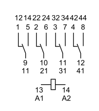

# LoRaWAN Irrigation System - Complete Design & Implementation Guide

## Executive Summary

This document provides a complete design and implementation guide for a battery-powered LoRaWAN irrigation control system using Dragino components and S-392T-3W latching solenoid valves. The system provides remote monitoring and control of agricultural irrigation with ultra-low power consumption and off-grid operation capability.

**Key Features:**

- Off-grid battery operation (45-72 days autonomy without solar)
- Remote control via LoRaWAN and Tailscale VPN
- Ultra-low power consumption (~1.2Wh daily)
- Professional latching valve technology
- Scalable multi-zone design

## 1. System Architecture

### 1.1 Network Topology

```
                           Internet Cloud
                                 |
                                 | (Ethernet/4G)
                                 v
                       +---------------------+
                       |      LPS8v2         | <-- LoRaWAN Gateway + Server
                       |      Gateway        |     IP: 192.168.1.100:8000
                       +---------------------+
                                 |
                                 | LoRaWAN EU868
                                 | Range: 2-5km
                                 v
       +-----------------+   +-----------------+   +-----------------+
       |     Zone 1      |   |     Zone 2      |   |     Zone 3      |
       +-----------------+   +-----------------+   +-----------------+
       | SE01-LB Sensor  |   | SE01-LB Sensor  |   | SE01-LB Sensor  |
       | LT-22222-L Ctrl |   | LT-22222-L Ctrl |   | LT-22222-L Ctrl |
       | S-392T-3W Valve |   | S-392T-3W Valve |   | S-392T-3W Valve |
       | 9Ah AGM Battery |   | 9Ah AGM Battery |   | 9Ah AGM Battery |
       | WS10M Solar Kit |   | WS10M Solar Kit |   | WS10M Solar Kit |
       +-----------------+   +-----------------+   +-----------------+
```

### 1.2 Component Overview

| Component      | Model                   | Function                 | Specifications                |
| -------------- | ----------------------- | ------------------------ | ----------------------------- |
| **Gateway**    | [LPS8v2](https://www.dragino.com/products/lora-lorawan-gateway/item/228-lps8v2.html) | LoRaWAN Gateway + Server | Built-in ChirpStack, Node-RED |
| **Sensor**     | [SE01-LB](https://www.dragino.com/products/agriculture-weather-station/item/277-se01-lb.html) | Soil Moisture/EC/Temp    | LoRaWAN, 5-year battery life  |
| **Controller** | [LT-22222-L](https://www.dragino.com/products/lora-lorawan-end-node/item/156-lt-22222-l.html) | I/O Control + LoRaWAN    | 4mA sleep, relay output       |
| **Relay**      | [Finder 55.34.9.012.0040](https://de.rs-online.com/web/p/elektrische-relais/0385913) | DPDT Polarity Switching  | 12V coil, 5A contacts         |
| **Socket**     | [Finder 94.04](https://de.rs-online.com/web/p/relaissockel/4009146) | Relay Socket             | For 55.34 series relays       |
| **Suppressor** | [Finder 99.02.9.024.99](https://de.rs-online.com/web/p/steckbare-funktionsmodule/6668015) | EMC Suppression          | For relay coil protection     |
| **Valve**      | [S-392T-3W](https://www.bermad.com/product/s-392t-3w/) | 3-Way Latching Solenoid  | 2-wire polarity-controlled    |
| **Battery**    | [Sealed Lead-Acid Battery 9Ah](https://de.rs-online.com/web/p/bleiakkus/1748858) | AGM/Gel UPS Standard     | 108Wh capacity                |
| **Solar**      | [WATTSTUNDE WS10-M](https://solarkontor.de/10W-Solar-Inselanlage-Bausatz-WATTSTUNDE-3A-Solar-Laderegler-PEKO3) | 10Wp Monocrystalline     | 40Wh/day, essential for 9Ah   |

## 2. Hardware Specifications

### 2.1 Dragino SE01-LB Soil Moisture Sensor

**Measurement Capabilities:**

- Soil Moisture: 0-100.00 V/V % (Volumetric Water Content)
- Soil Temperature: -40°C to 85°C
- Soil Electrical Conductivity: 0-20,000 µS/cm

**Accuracy:**

- Moisture: ±3% (0-53%), ±5% (>53%)
- Temperature: ±0.3°C (-10°C to 50°C)
- EC: 2% full scale

**Power & Battery:**

- Power Source: 8500mAh Li/SOCl2 battery (replaceable)
- Battery Life: Up to 5 years
- Ultra-low power consumption
- No external power required

**Communication:**

- LoRaWAN 1.0.3 Class A
- Frequency: EU868, US915, AU915, AS923, etc.
- Bluetooth v5.1 for configuration
- Over-the-air (OTA) firmware updates

**Physical:**

- Dimensions: 195 x 125 x 55 mm
- Weight: 420g
- IP66 Waterproof enclosure
- Operating Temperature: -40°C to 85°C

_Note: SE01-LS variant available with solar panel + 3000mAh Li-ion battery_

### 2.2 S-392T-3W Latching Valve

**Electrical Specifications:**

- Voltage Range: 9-20 VDC
- Coil Resistance: 6Ω
- Coil Inductance: 15/18 mH (off/on)
- Pulse Width: 20-100ms
- Peak Current: 12V ÷ 6Ω = 2A (pulse only)
- Holding Current: 0A (latching mechanism)
- Connection: 2-wire coil control (Red/Black)

**Operation Modes (electrical connections):**

- **+Red & -Black:** Solenoid vents (bypass/drain position)
- **+Black & -Red:** Solenoid pressurizes (irrigation position)
- **No power:** Valve maintains last position (latching)

**Operating Principle:**

- **3-way valve** with 2-wire polarity-controlled operation
- **Latching:** Valve maintains position after pulse without power
- **Polarity Reversal:** Changes between vent and pressurize modes

### 2.3 LT-22222-L LoRaWAN Controller

**Power Specifications:**

- Input Voltage: 7-24V DC (using 12V)
- Sleep Current: 4mA @ 12V (official datasheet specification)
- Active Current: ~20mA @ 12V (brief periods)
- LoRaWAN TX: ~100mA for 5 seconds per transmission
- Idle Power: 0.048W (4mA × 12V)

**I/O Specifications:**

- **Relay Outputs (RECOMMENDED):** 2x (RO1, RO2) rated 5A@250VAC/30VDC - Use for valve control
- **Digital Outputs:** 2x (DO1, DO2) NPN type, max 450mA each - NOT suitable for valve control
- **Output Logic:** INVERTED (DO=1 means LOW/GND, DO=0 means HIGH/floating)
- **Pulse Mode:** Configurable pulse duration for relay outputs (20ms to 65535ms)
- **Digital Inputs:** 2x for sensors/feedback (max 50V)
- **Analog Inputs:** 2x (0-20mA or 0-30V)

**Communication:**

- LoRaWAN Region: EU868
- Range: 2-5km line of sight
- Adaptive Data Rate: Yes
- Security: AES128 encryption

### 2.4 Solar Panel and Charge Controller Specifications

**WATTSTUNDE WS10-M Solar Panel:**

- Nominal Power (Pmpp): 10Wp
- Module Type: Monocrystalline, 36 cells
- Open Circuit Voltage (Voc): 21.96V
- Voltage at Max Power (Vmpp): 17.82V
- Short Circuit Current (Isc): 0.63A
- Current at Max Power (Impp): 0.57A
- Module Efficiency: 18%
- Daily Energy Yield: 40Wh (average)
- Dimensions: 295 x 295 x 20mm
- Weight: 1.7kg
- Junction Box: IP65 weatherproof
- Features: Bypass diodes for partial shading tolerance

**WATTSTUNDE PEKO3 Charge Controller:**

- Type: PWM (Pulse Width Modulation) with multi-stage charging
- Max Solar Input: 3A / 50W (12V system)
- Max Solar Voltage: 30V
- Battery Voltage Range: 6-30V (supports 12V systems)
- Charging Voltages: Bulk 14.4V, Float 13.8V, LVD 11.1V (corrected)
- Load Output: 3A max (protected)
- Operating Temperature: -40°C to +45°C
- Dimensions: 90 x 48 x 18mm
- Weight: 50g

**Protection Features:**

- Overcharge protection with automatic disconnect
- Deep discharge protection (LVD - Low Voltage Disconnect)
- Temperature compensation for optimal charging
- Reverse current protection at night
- Short circuit and overload protection
- Self-test function

**Load Control:**

- 3A load output perfect for LT-22222-L controller
- Automatic disconnect at low battery (LVD)
- Automatic reconnect when battery recovers (LVR)
- Protects battery from deep discharge by loads

### 2.5 Sealed Lead-Acid Battery 9Ah

**Electrical Specifications:**

- Voltage: 12V
- Capacity: 9Ah (108Wh)
- Type: AGM/Gel sealed lead-acid
- Self-discharge: <3% per month
- Cycle life: 300-500 cycles at 50% DoD

**Physical Specifications:**

- Dimensions: 151 x 65 x 94mm
- Weight: ~2.5kg
- Terminals: Faston F2 6.4mm
- Position: Any orientation (sealed)

**Key Advantages:**

- Standard UPS battery format (widely available)
- Multiple manufacturers (APC, CSB, Yuasa, etc.)
- Lower cost than LiFePO4
- No special charger requirements
- Proven reliability in outdoor applications

### 2.6 System Voltage Reference Table

| Component                   | Voltage Specification | Purpose                     |
| --------------------------- | --------------------- | --------------------------- |
| **S-392T-3W Valve**         | 9-20V DC              | Operating voltage range     |
| **LT-22222-L Controller**   | 7-24V DC input        | Power supply range          |
| **PEKO3 Charge Controller** |                       |                             |
| - Solar input               | Up to 30V             | Maximum PV voltage          |
| - Battery range             | 6-30V                 | Compatible battery voltages |
| - Bulk charge               | 14.4V                 | AGM/Gel charging voltage    |
| - Float charge              | 13.8V                 | Maintenance voltage         |
| - LVD cutoff                | 11.1V                 | Low voltage disconnect      |
| - LVR reconnect             | 12.6V                 | Load reconnect voltage      |
| **System Operation**        |                       |                             |
| - Normal operation          | 12.6-13.8V            | Typical operating range     |
| - Minimum valve voltage     | 11.6V                 | At 50m cable (with drop)    |
| - Maximum safe voltage      | 15V                   | Component protection limit  |

### 2.7 Charging System Compatibility

**PEKO3 + Powery AGM/Gel Battery:**

- PEKO3 designed for lead-acid batteries (perfect match)
- Multi-stage PWM charging optimizes battery life
- Temperature compensation adjusts for ambient conditions
- Verified charging voltages for 12V AGM/Gel:
  - Bulk charge: 14.4V (optimal for AGM)
  - Float charge: 13.8V (maintains full charge)
  - LVD cutoff: 11.1V (protects from deep discharge)
  - LVR reconnect: 12.6V (safe restart voltage)

**Benefits:**

- Prevents overcharging and gassing
- Extends battery life with proper charging profile
- Automatic load disconnect protects from deep discharge
- No manual intervention required

### 2.7 Battery System Design

**Power Consumption Analysis:**

- S-392T-3W pulse: 12V × 2A × 0.05s = 1.2 Watt-seconds = 0.000333Wh per operation ✓
- Valve operations: Assume 4 operations/day = 4 × 0.000333Wh = 0.001332Wh per day
- LT-22222-L sleep: 4mA × 12V × 24h = 1.152Wh per day
- Relay coil power: 12V × 25mA × 0.2s × 4/day = 0.0024Wh per day (200ms pulses)
- LoRaWAN transmissions: 100mA × 12V × 5s × 24/day = 0.04Wh per day
- SE01-LB sensor: 0Wh (self-powered with 5-year battery life)
- Total daily consumption: ~1.196Wh per day (1.152 + 0.04 + 0.001332 + 0.0024)

Note: SE01-LB sensor has its own 8500mAh Li/SOCl2 battery with 5-year life,
so it doesn't add to the system power consumption.

**Battery Sizing (Powery 12V 9Ah AGM/Gel):**

- Total capacity: 12V × 9Ah = 108Wh
- Temperature derating (0°C): 108Wh × 0.8 = 86.4Wh
- Usable capacity (50% DoD recommended): 86.4Wh × 0.5 = 43.2Wh
- Usable capacity (80% DoD emergency): 86.4Wh × 0.8 = 69.1Wh
- System efficiency factor: 0.9 (10% losses)
- Autonomy at 50% DoD: (43.2Wh × 0.9) ÷ 1.196Wh = 32.5 days without solar
- Autonomy at 80% DoD: (69.1Wh × 0.9) ÷ 1.196Wh = 52.1 days without solar
- Note: AGM/Gel batteries should not regularly exceed 50% DoD for longevity

**Solar Sizing (WATTSTUNDE WS10-M):**

- Panel generates 40Wh daily (manufacturer spec, optimal conditions)
- Charging efficiency losses: 40Wh × 0.85 = 34Wh usable daily
- Winter derating factor: 34Wh × 0.6 = 20.4Wh (worst case)
- Daily consumption: 1.196Wh
- Net surplus (summer): 34Wh - 1.196Wh = +32.8Wh daily
- Net surplus (winter): 20.4Wh - 1.196Wh = +19.2Wh daily
- Battery recharge time from 50% DoD: 43.2Wh ÷ 19.2Wh = 2.3 days (winter)
- Result: System is energy-positive year-round with proper installation
- Note: Solar is essential with 9Ah battery for continuous operation

## 2.8 System Power Design and Output Selection

**Output Configuration:**

The LT-22222-L controller provides two types of outputs with different current ratings:
- **Relay Outputs (RO1, RO2):** 5A@250VAC/30VDC - designed for high-current switching
- **Digital Outputs (DO1, DO2):** 450mA maximum - suitable for low-power signaling only

**Design Specification:**

For reliable valve control, the system exclusively uses relay outputs (RO1, RO2) due to their 5A rating, which safely handles the 2A valve coil current with adequate safety margin.

**System Architecture:**

- **Power Flow:** Solar Panel → PEKO3 Charge Controller → Battery & Load Output (3A) → LT-22222-L → Relay Outputs (5A) → Valve Circuit
- **Control Strategy:** RO1 controls polarity switching, RO2 provides valve activation pulse
- **Circuit Protection:** 2A fuse protects valve circuit from overcurrent conditions

## 2.9 Latching Valve Control

The S-392T-3W latching valve requires polarity reversal to change states. This system uses a simple two-relay approach.

### 2.9.1 How It Works

**Simple Concept:**

- **RO1 (Polarity Switch)**: Sets valve direction (ON = open, OFF = close)
- **RO2 (Pulse Generator)**: Sends 200ms pulse to activate valve
- **DPDT Relay**: Switches polarity based on RO1, activated by RO2

**Components Required:**

- 1x Finder 55.34.9.012.0040 DPDT relay (12V coil)
- 1x Finder 94.04 relay socket
- 1x Finder 99.02.9.024.99 EMC suppression module
- 2A fuse for valve circuit protection

### 2.9.2 Wiring Connections

**Finder 55.34.9.012.0040 Relay Pinout:**



**Controller to Relay:**

| LT-22222-L Output | Connect To | Purpose |
|-------------------|------------|---------|
| **RO1 COM** | +12V | Power for relay coil |
| **RO1 NO** | Relay Coil A1 | Controls polarity switching |
| **RO2 COM** | +12V | Power for valve pulse |
| **RO2 NO** | Relay Coil A1 (parallel with RO1) | Activates relay during pulse |
| **GND** | Relay Coil A2 | Coil return |

**Power Supply to Relay:**

| Power Source | Connect To | Purpose |
|--------------|------------|---------|
| **+12V** | Relay Terminal 11 (COM) | Common +12V for polarity switching |
| **GND** | Relay Terminal 21 (COM) | Common GND for polarity switching |

**Relay to Valve:**

| Relay Terminal | Connect To | What It Does |
|----------------|------------|--------------|
| **12 (NC)** | Valve Terminal 1 | CLOSE: +12V to red wire |
| **14 (NO)** | Valve Terminal 2 | OPEN: +12V to black wire |
| **22 (NC)** | Valve Terminal 2 | CLOSE: GND to black wire |
| **24 (NO)** | Valve Terminal 1 | OPEN: GND to red wire |

### 2.9.3 Operation

**To CLOSE valve (Bypass):**

1. **Set polarity:** RO1 stays OFF (relay contacts at rest position)
2. **Send pulse:** RO2 sends 200ms pulse → Terminal 1 = +12V, Terminal 2 = GND
3. **Result:** Valve switches to bypass position, then no power

**To OPEN valve (Irrigation):**

1. **Set polarity:** RO1 turns ON indefinitely (relay contacts switch)
2. **Send pulse:** RO2 sends 200ms pulse → Terminal 1 = GND, Terminal 2 = +12V
3. **Reset polarity:** RO1 returns to OFF (MANDATORY - saves power)
4. **Result:** Valve switches to irrigation position, then no power

**Important:** 
- Always send RO1 command first, then RO2 pulse after 500ms delay
- RO1 MUST return to OFF after operation to save power (prevents continuous relay coil current)
- RO2 pulse activates both RO1 and RO2 coils in parallel during valve switching

## 2.10 LoRaWAN Command Protocol Reference

**LT-22222-L Downlink Command Format:**

```
Byte 0: Command Type (0x02 for relay control)
Byte 1: Relay Number (0x01 for RO1, 0x02 for RO2)
Byte 2: Action (0x01 for ON, 0x00 for OFF)
Byte 3: Duration (0xC8 = 200ms, 0x32 = 50ms)
```

**Valve Control Commands:**

```
Open Valve (Irrigation):
- Step 1: Set polarity - Hex: 020101FF (RO1 ON indefinitely)
- Step 2: Send pulse - Hex: 020201C8 (RO2 ON for 200ms)
- Step 3: Reset polarity - Hex: 020100C8 (RO1 OFF for 200ms) [MANDATORY - saves power]
- Function: RO1 sets polarity, RO2 provides pulse → Terminal 1 = GND, Terminal 2 = +12V → OPEN
- Result: Valve switches to irrigation position, then no voltage

Close Valve (Bypass):
- Step 1: Set polarity - Hex: 020100FF (RO1 OFF indefinitely)
- Step 2: Send pulse - Hex: 020201C8 (RO2 ON for 200ms)
- Step 3: Reset polarity - Hex: 020100C8 (RO1 OFF for 200ms) [MANDATORY - saves power]
- Function: RO1 sets polarity, RO2 provides pulse → Terminal 1 = +12V, Terminal 2 = GND → CLOSE
- Result: Valve switches to bypass position, then no voltage

Status Query:
- Hex: 01
- Function: Request current relay states and system status
```

**Verification Commands (AT Interface):**

```
AT+RO1TIME=65535  # Set RO1 to maximum duration (indefinite)
AT+RO2TIME=200    # Set RO2 pulse duration to 200ms
AT+RO1=1          # Test RO1 activation (set polarity - stays ON)
AT+RO1=0          # Test RO1 deactivation (reset polarity)
AT+RO2=1          # Test RO2 activation (valve pulse - 200ms only)
AT+STATUS         # Check current relay states
```

**Polarity Reversal Testing Procedure:**

```
1. Pre-Installation Testing:
   - Measure valve coil resistance: Should be 6Ω ± 10%
   - Verify valve terminals are correctly identified
   - Test controller RO1 and RO2 relay outputs with multimeter

2. Circuit Verification:
   - Connect multimeter across valve terminals
   - Default state: Both relays OFF → No voltage (0V across terminals)
   - Test CLOSE: AT+RO1=0 (set polarity), then AT+RO2=1 (pulse)
   - Verify: Terminal 1 = +12V, Terminal 2 = GND for 200ms, then 0V
   - Test OPEN: AT+RO1=1 (set polarity), then AT+RO2=1 (pulse)
   - Verify: Terminal 1 = GND, Terminal 2 = +12V for 200ms, then 0V
   - MANDATORY: AT+RO1=0 to reset polarity after each test (saves power)

3. Functional Testing:
   - Start with valve in known position
   - Send CLOSE sequence: RO1 OFF (polarity) + RO2 pulse → Valve to bypass position
   - Send OPEN sequence: RO1 ON (polarity) + RO2 pulse → Valve to irrigation position
   - Verify water flow direction matches expected operation
   - Confirm valve maintains position after pulse (no continuous power)
   - MANDATORY: Reset polarity after each operation: AT+RO1=0 (saves power)

4. Current Monitoring:
   - Monitor pulse current: Should be ~2A for 200ms during RO2 pulse only
   - RO1 current should be minimal (~25mA for relay coil)
   - Verify no continuous current to valve after RO2 pulse
   - Check fuse integrity after multiple operations
   - Ensure RO2 returns to OFF state after pulse, RO1 MUST be reset to OFF to save power
```

## 3. Installation Procedures

### 3.1 Site Preparation

1. **Zone Planning:**

   - Identify irrigation zones and water supply points
   - Locate optimal positions for soil sensors (representative areas)
   - Plan controller locations (central, accessible, protected)
   - Design valve positions on main supply lines

2. **Infrastructure:**
   - Install weatherproof enclosures for controllers and batteries
   - Plan underground cable routes (minimum 60cm depth)
   - Prepare mounting points for solar panels (south-facing)
   - Ensure LoRaWAN coverage from gateway location

### 3.2 Gateway Installation

```bash
LPS8v2 Gateway Setup:
1. Physical Installation:
   - Mount in weatherproof location with internet access
   - Connect ethernet cable or configure WiFi/4G
   - Install LoRaWAN antenna with clear line of sight

2. Initial Configuration:
   - Access web interface: http://[gateway-ip]:8000
   - Login: admin/dragino
   - Enable built-in LoRaWAN server
   - Configure EU868 frequency plan
   - Set up Node-RED dashboard

3. Network Configuration:
   - Configure static IP or DHCP
   - Test internet connectivity
   - Enable auto-update for firmware
```

### 3.3 Zone Installation (Per Zone)

```bash
Step 1: Battery System Installation
- Mount Powery 12V 9Ah AGM/Gel battery in weatherproof enclosure
- Connect Faston F2 terminals with proper polarity
- Install 2A fuse and WATTSTUNDE PEKO3 charge controller
- Connect WATTSTUNDE WS10-M solar panel (south-facing, 30-45° tilt)
- Test system voltage (should show 12.2-12.8V for AGM/Gel)
- Verify PEKO3 LED indicators show charging status

Step 2: Controller Installation
- Mount LT-22222-L in protected location
- Connect to PEKO3 charge controller load output
- Configure via USB serial (115200 baud):
  AT+RO1TIME=200       # 200ms relay pulse duration
  AT+RO1POLL=0         # Relay 1 polarity (0=normal)
  AT+RO2TIME=200       # Configure relay 2 if used
  AT+SLEEP=1           # Enable deep sleep
  AT+TXINTERVAL=3600   # Transmit hourly
  AT+CFGDEV            # Save configuration

  Note: Using relay outputs (RO1) instead of digital outputs (DO1)
  for proper 2A current handling

Step 3: Valve Installation
- Install S-392T-3W on main water line
- Verify correct flow direction (arrow on valve body)
- Connect Port 1 to water supply
- Connect Port 2 to irrigation zone
- Connect Port 3 to bypass/drain (optional)
- Connect valve coil terminals 1 and 2 to DPDT relay contacts
- Test for leaks at operating pressure

Step 4: SE01-LB Sensor Installation
- Install SE01-LB at 20-30cm depth in representative soil area
- Ensure good soil contact around sensing elements
- Position cable exit upward to prevent water ingress
- Configure via Bluetooth app:
  - Set transmission interval (e.g., every 30 minutes)
  - Configure moisture/EC/temp thresholds
  - Join to LoRaWAN network using OTAA
- Register with gateway using DevEUI/AppEUI/AppKey
- Verify data reception in gateway dashboard

Step 5: System Testing
- Configure AT commands for improved valve control:
  AT+RO1TIME=65535  # Set RO1 to indefinite duration
  AT+RO2TIME=200    # Set RO2 to 200ms pulse
- Test valve operation sequence:
  OPEN: AT+RO1=1 (set polarity), AT+RO2=1 (pulse valve), AT+RO1=0 (reset)
  CLOSE: AT+RO1=0 (set polarity), AT+RO2=1 (pulse valve), AT+RO1=0 (reset)
- For 3-way valve: RO1 state controls polarity, RO2 pulse activates valve
- Verify water flow in both positions
- Check LoRaWAN connectivity (RSSI > -100dBm)
- Monitor battery voltage and charging
```

## 4. Software Configuration

### 4.1 LPS8v2 Gateway Setup

```bash
Built-in LoRaWAN Server Configuration:
1. Device Registration:
   - Add each LT-22222-L controller
   - Add each SE01-LB sensor
   - Configure DevEUI, AppEUI, AppKey for each device

2. Application Setup:
   - Create application: "IrrigationControl"
   - Set up device groups by zone
   - Configure uplink/downlink handling
   - SE01-LB sensors join via OTAA authentication

3. Integration Setup:
   - Enable MQTT broker for Node-RED
   - Configure HTTP webhooks if needed
   - Set up data forwarding to external systems
```

### 4.2 Node-RED Dashboard Programming

**Note**: Valve control requires a two-step process:

1. **Set Polarity**: Send RO1 command (ON for OPEN, OFF for CLOSE)
2. **Send Pulse**: Send RO2 command after 500ms delay to activate valve
3. **Result**: Valve switches to desired position, then no continuous power

```javascript
// Flow 1: Soil Moisture Processing
[MQTT Input] → [JSON Parser] → [Function: Extract Moisture] → [Dashboard Gauge]

// Function: Extract Moisture Values
var moisture = msg.payload.object.Moisture;
var temperature = msg.payload.object.Temperature;
var battery = msg.payload.object.Battery;

msg.payload = {
    moisture: moisture,
    temperature: temperature,
    battery: battery,
    zone: msg.topic.split('/')[3] // Extract zone from topic
};

return msg;

// Flow 2: Automatic Irrigation Logic
[Moisture Input] → [Function: Irrigation Decision] → [MQTT Output to Valve]

// Function: Irrigation Decision Logic
var moisture = msg.payload.moisture;
var zone = msg.payload.zone;
var valve_status = context.get(zone + "_valve_status") || "CLOSE";

// Irrigation thresholds (adjustable per crop type)
var dry_threshold = 30;    // Start irrigation at 30%
var wet_threshold = 70;    // Stop irrigation at 70%

if (moisture < dry_threshold && valve_status !== "OPEN") {
    // Open valve - improved three-step process: set polarity, pulse, optional reset
    var polarityCmd = {
        payload: {
            fPort: 2,
            data: "020101FF"  // RO1 on indefinitely - set polarity for OPEN
        },
        topic: "application/irrigation/device/" + zone + "/tx"
    };

    // Delay before pulse command
    setTimeout(function() {
        var pulseCmd = {
            payload: {
                fPort: 2,
                data: "020201C8"  // RO2 on, 200ms pulse - activate valve
            },
            topic: "application/irrigation/device/" + zone + "/tx"
        };
        node.send(pulseCmd);
        
        // MANDATORY: Reset polarity after valve activation to save power
        setTimeout(function() {
            var resetCmd = {
                payload: {
                    fPort: 2,
                    data: "020100C8"  // RO1 off, 200ms - reset polarity to save power
                },
                topic: "application/irrigation/device/" + zone + "/tx"
            };
            node.send(resetCmd);
        }, 1000); // 1000ms after pulse command
    }, 500); // 500ms delay between polarity and pulse commands

    context.set(zone + "_valve_status", "OPEN");
    context.set(zone + "_last_action", new Date().toISOString());

    // Status message
    var status = {
        payload: "Zone " + zone + ": Irrigation STARTED (Moisture: " + moisture + "%)"
    };

    return [polarityCmd, status];

} else if (moisture > wet_threshold && valve_status !== "CLOSE") {
    // Close valve - improved three-step process: set polarity, pulse, optional reset
    var polarityCmd = {
        payload: {
            fPort: 2,
            data: "020100FF"  // RO1 off indefinitely - set polarity for CLOSE
        },
        topic: "application/irrigation/device/" + zone + "/tx"
    };

    // Delay before pulse command
    setTimeout(function() {
        var pulseCmd = {
            payload: {
                fPort: 2,
                data: "020201C8"  // RO2 on, 200ms pulse - activate valve
            },
            topic: "application/irrigation/device/" + zone + "/tx"
        };
        node.send(pulseCmd);
        
        // MANDATORY: Reset polarity after valve activation to save power
        setTimeout(function() {
            var resetCmd = {
                payload: {
                    fPort: 2,
                    data: "020100C8"  // RO1 off, 200ms - reset polarity to save power
                },
                topic: "application/irrigation/device/" + zone + "/tx"
            };
            node.send(resetCmd);
        }, 1000); // 1000ms after pulse command
    }, 500); // 500ms delay between polarity and pulse commands

    context.set(zone + "_valve_status", "CLOSE");
    context.set(zone + "_last_action", new Date().toISOString());

    // Status message
    var status = {
        payload: "Zone " + zone + ": Irrigation STOPPED (Moisture: " + moisture + "%)"
    };

    return [polarityCmd, status];
}

// No action needed
return null;

// Flow 3: Manual Control Interface
[Dashboard Button] → [Function: Manual Control] → [MQTT Output]

// Function: Manual Valve Control
var command = msg.payload; // "OPEN" or "CLOSE" from dashboard
var zone = msg.topic; // Zone identifier

if (command === "OPEN") {
    // Step 1: Set polarity for OPEN (RO1 ON)
    var polarityCmd = {
        payload: {
            fPort: 2,
            data: "020101FF"  // RO1 on indefinitely - set polarity for OPEN
        },
        topic: "application/irrigation/device/" + zone + "/tx"
    };

    // Step 2: Send pulse after delay (RO2 ON)
    setTimeout(function() {
        var pulseCmd = {
            payload: {
                fPort: 2,
                data: "020201C8"  // RO2 on, 200ms pulse - activate valve
            },
            topic: "application/irrigation/device/" + zone + "/tx"
        };
        node.send(pulseCmd);
        
        // Step 3: MANDATORY reset polarity after valve activation to save power
        setTimeout(function() {
            var resetCmd = {
                payload: {
                    fPort: 2,
                    data: "020100C8"  // RO1 off, 200ms - reset polarity to save power
                },
                topic: "application/irrigation/device/" + zone + "/tx"
            };
            node.send(resetCmd);
        }, 1000); // 1000ms after pulse command
    }, 500); // 500ms delay between commands

    return polarityCmd;

} else if (command === "CLOSE") {
    // Step 1: Set polarity for CLOSE (RO1 OFF)
    var polarityCmd = {
        payload: {
            fPort: 2,
            data: "020100FF"  // RO1 off indefinitely - set polarity for CLOSE
        },
        topic: "application/irrigation/device/" + zone + "/tx"
    };

    // Step 2: Send pulse after delay (RO2 ON)
    setTimeout(function() {
        var pulseCmd = {
            payload: {
                fPort: 2,
                data: "020201C8"  // RO2 on, 200ms pulse - activate valve
            },
            topic: "application/irrigation/device/" + zone + "/tx"
        };
        node.send(pulseCmd);
        
        // Step 3: MANDATORY reset polarity after valve activation to save power
        setTimeout(function() {
            var resetCmd = {
                payload: {
                    fPort: 2,
                    data: "020100C8"  // RO1 off, 200ms - reset polarity to save power
                },
                topic: "application/irrigation/device/" + zone + "/tx"
            };
            node.send(resetCmd);
        }, 1000); // 1000ms after pulse command
    }, 500); // 500ms delay between commands

    return polarityCmd;
}

return null;
```

### 4.3 Dashboard Layout Design

```
Mobile-Optimized Dashboard (1 column layout):
┌─────────────────────────────────┐
│        Irrigation Control       │
├─────────────────────────────────┤
│ Zone 1: Field North             │
│ Moisture: [45%] ████▓▓▓▓▓▓      │
│ Temperature: 22°C               │
│ Battery: 12.4V                  │
│ Status: IRRIGATING              │
│ [STOP] [START] [BYPASS]         │
├─────────────────────────────────┤
│ Zone 2: Field South             │
│ Moisture: [65%] ████████▓▓      │
│ Temperature: 24°C               │
│ Battery: 12.6V                  │
│ Status: STANDBY                 │
│ [STOP] [START] [BYPASS]         │
├─────────────────────────────────┤
│ Zone 3: Field East              │
│ Moisture: [25%] ██▓▓▓▓▓▓▓▓      │
│ Temperature: 26°C               │
│ Battery: 11.8V (WARNING)        │
│ Status: AUTO STARTING           │
│ [STOP] [START] [BYPASS]         │
├─────────────────────────────────┤
│ System Overview                 │
│ Gateway: Online                 │
│ Last Update: 14:32              │
│ Weather: Sunny 28°C             │
│ [EMERGENCY STOP ALL]            │
└─────────────────────────────────┘
```

## 5. Tailscale VPN Configuration

### 5.1 Gateway VPN Setup

```bash
# SSH to LPS8v2 Gateway
ssh root@[gateway-ip]

# Install Tailscale (OpenWrt)
opkg update
opkg install tailscale

# Start and enable service
service tailscale enable
service tailscale start

# Join Tailscale network
tailscale up --advertise-routes=192.168.1.0/24 --accept-routes

# Configure as subnet router for secure remote access
```

### 5.2 Remote Access Benefits

- **Secure VPN Access:** No open ports needed in firewall
- **Mobile Control:** Access dashboard from anywhere via Tailscale app
- **Technician Support:** Authorized personnel can remotely diagnose issues
- **Multi-user Access:** Different permission levels via Tailscale ACLs
- **Audit Trail:** All access logged and monitored

## 6. System Costs and ROI

### 6.1 Complete System Cost (3 Zones)

| Component                     | Qty | Unit Price | Total      |
| ----------------------------- | --- | ---------- | ---------- |
| **Gateway & Central**         |     |            |            |
| LPS8v2 LoRaWAN Gateway        | 1   | 250€       | 250€       |
| Raspberry Pi (Node-RED)       | 1   | 100€       | 100€       |
| **Per Zone (×3)**             |     |            |            |
| Dragino SE01-LB Sensor        | 3   | 150€       | 450€       |
| LT-22222-L LoRaWAN Controller | 3   | 150€       | 450€       |
| S-392T-3W Latching Valve      | 3   | 200€       | 600€       |
| Finder 55.34.9.012.0040 Relay | 3   | 15€        | 45€        |
| Finder 94.04 Relay Socket     | 3   | 5€         | 15€        |
| Finder 99.02.9.024.99 Suppressor | 3   | 8€         | 24€        |
| 2A Fuse + Holder             | 3   | 3€         | 9€         |
| Powery 12V 9Ah AGM/Gel        | 3   | 25€        | 75€        |
| [WATTSTUNDE WS10-M Solar Kit](https://solarkontor.de/10W-Solar-Inselanlage-Bausatz-WATTSTUNDE-3A-Solar-Laderegler-PEKO3) | 3   | 40€        | 120€       |
| PEKO3 Controller (in kit)     | -   | -          | included   |
| Weatherproof Enclosures       | 3   | 40€        | 120€       |
| **Installation**              |     |            |            |
| Cables and Fittings           | -   | 150€       | 150€       |
| **TOTAL SYSTEM COST**         |     |            | **2,303€** |

### 6.2 Annual Operating Costs

- **Electricity:** 0€ (solar powered)
- **LoRaWAN Service:** 50€/year (all devices)
- **Maintenance:** 100€/year (annual inspection)
- **Battery Replacement:** 25€ every 3-5 years (AGM/Gel battery)
- **Total Annual:** 175€ (with prorated battery replacement)

### 6.3 Return on Investment

**Water Savings:**

- Precision irrigation reduces water waste by 30-40%
- Automated scheduling prevents over/under watering
- Remote monitoring prevents system failures

**Labor Savings:**

- Eliminates daily manual valve operations
- Remote monitoring reduces field visits
- Automated operation reduces management time

**Crop Yield Improvements:**

- Optimal soil moisture increases yields by 15-25%
- Reduced plant stress improves quality
- Prevention of drought/flood damage

**ROI Calculation (per hectare):**

- System cost: ~1,000€/hectare
- Annual savings: 400-600€/hectare
- Payback period: 1.5-2.5 years
- 10-year NPV: 2,500-4,000€/hectare

## 7. Maintenance and Troubleshooting

### 7.1 Preventive Maintenance Schedule

**Monthly (Remote):**
- [ ] Check battery voltages via dashboard
- [ ] Verify LoRaWAN connectivity (all devices)
- [ ] Review irrigation logs and anomalies
- [ ] Test manual valve controls

**Quarterly (Field Visit):**
- [ ] Clean solar panels
- [ ] Inspect weatherproof enclosures
- [ ] Test valve operation manually
- [ ] Calibrate soil moisture sensors
- [ ] Check cable connections

**Annually (Professional Service):**
- [ ] Replace valve O-rings and seals
- [ ] Test system under full pressure
- [ ] Update firmware on all devices
- [ ] Performance optimization review

### 7.2 Common Issues and Solutions

**Issue: Valve doesn't respond to commands**
Diagnostics:

- Check battery voltage (should be >11V)
- Verify LoRaWAN connectivity (RSSI)
- Test with improved AT command sequence:
  AT+RO1TIME=65535  # Set RO1 to indefinite duration
  AT+RO2TIME=200    # Set RO2 to 200ms pulse
  AT+RO1=1          # Set polarity
  AT+RO2=1          # Pulse valve
  AT+RO1=0          # Reset polarity

Solutions:

- Replace/charge battery if voltage low
- Improve antenna position if poor signal
- Check valve coil resistance (should be 6Ω)
- Verify relay is clicking when activated
- Ensure proper command sequence timing

**Issue: Inconsistent soil moisture readings**
Diagnostics:

- Compare multiple sensors in same area
- Check sensor calibration values
- Verify proper installation depth

Solutions:

- Recalibrate sensors annually
- Replace sensors after 5+ years
- Ensure proper soil contact

**Issue: Short battery life**
Diagnostics:

- Monitor daily power consumption
- Check solar panel performance
- Verify sleep mode operation

Solutions:

- Clean/realign solar panels
- Update firmware for better power management
- Check for water ingress in electronics

### 7.3 Emergency Procedures

**Total System Failure:**

1. Manual valve operation (remove power, manually operate)
2. Backup irrigation schedule (timer-based)
3. Emergency contact technician
4. Document failure for analysis

**Communication Loss:**

1. Check gateway internet connection
2. Verify LoRaWAN coverage
3. Switch to manual/timer operation
4. Schedule maintenance visit

**Water System Emergency:**

1. Emergency stop all valves via dashboard
2. Isolate affected zone manually
3. Check for leaks or pressure issues
4. Contact irrigation specialist

## 8. Future Expansion Options

### 8.1 Additional Sensors

- **Weather Station:** Rain, wind, temperature for smart scheduling
- **Flow Meters:** Monitor actual water usage per zone
- **Pressure Sensors:** Detect leaks and system issues
- **Nutrient Sensors:** Advanced fertigation control

### 8.2 Advanced Features

- **AI Scheduling:** Machine learning for optimal irrigation timing
- **Satellite Integration:** NDVI imagery for crop health monitoring
- **Weather API:** Integration with local weather forecasts
- **Mobile App:** Custom iOS/Android app for farmers

### 8.3 Scaling Considerations

- **Multi-Farm Management:** Central dashboard for multiple locations
- **Data Analytics:** Historical trending and yield correlation
- **Integration APIs:** Connect to farm management software
- **Regulatory Compliance:** Water usage reporting and documentation

---

## Conclusion

This LoRaWAN irrigation system provides a modern, efficient, and cost-effective solution for agricultural water management. The combination of ultra-low power consumption, professional-grade components, and intelligent automation delivers significant benefits:

- **45-72 days battery autonomy** without solar, indefinite with solar
- **Remote monitoring and control** via secure VPN access
- **Professional reliability** with latching valve technology
- **Rapid ROI** through water and labor savings
- **Scalable design** for farms of any size

The system is designed for easy installation, minimal maintenance, and long-term reliability, making it an ideal choice for modern sustainable agriculture.

**Next Steps:**

1. **Pilot Installation:** Start with one zone to validate performance
2. **System Commissioning:** Professional setup and testing
3. **User Training:** Dashboard operation and basic maintenance
4. **Expansion Planning:** Scale to additional zones based on results

For technical support or custom implementations, contact the system integrator or Dragino technical support.
